" MEMBUAT LIST "
1. Membuat dokumen HTML dengan nama file Lab3_list.html.
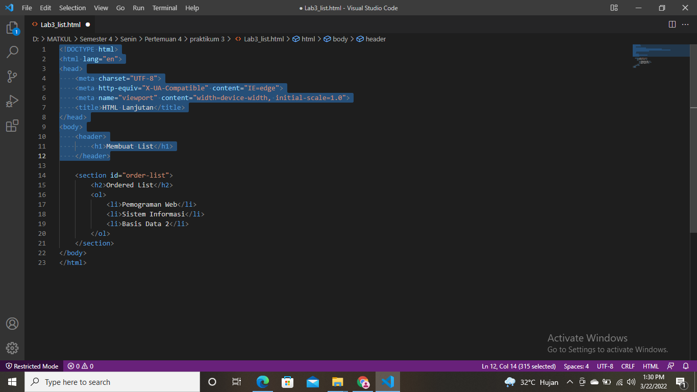
2. Kemudian membuat kode Ordered List seperti gambar dibawah ini.
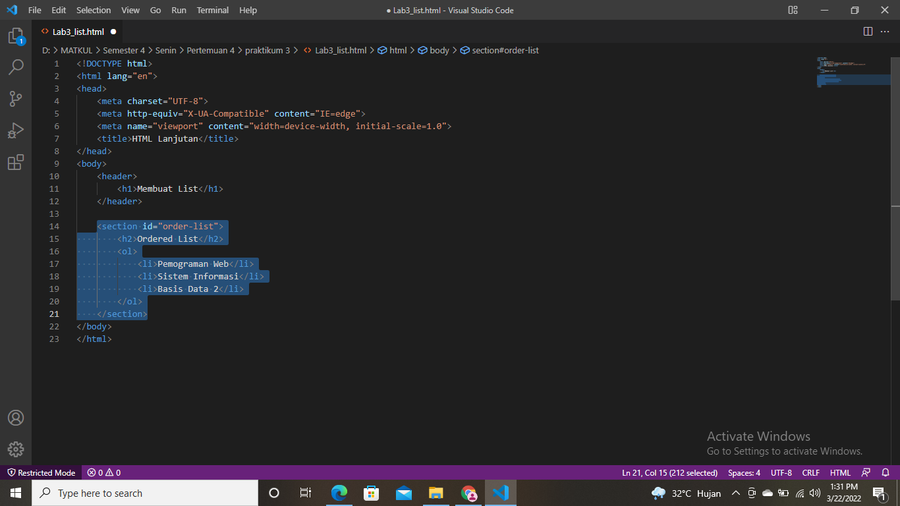
* Maka gambar yang akan tampil di website yaitu seperti berikut.
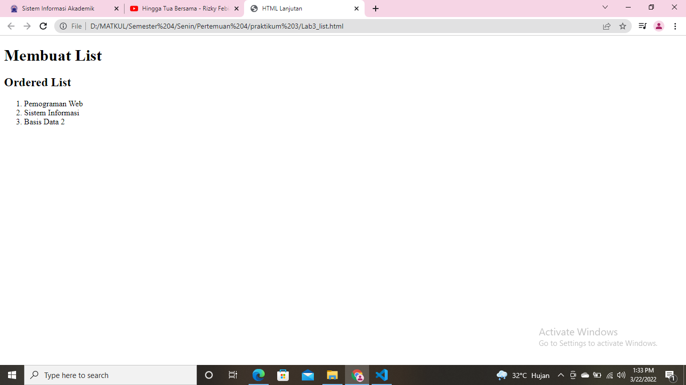

3. Membuat Unordered List setelah deklarasi ordered list pada section unordered-list.
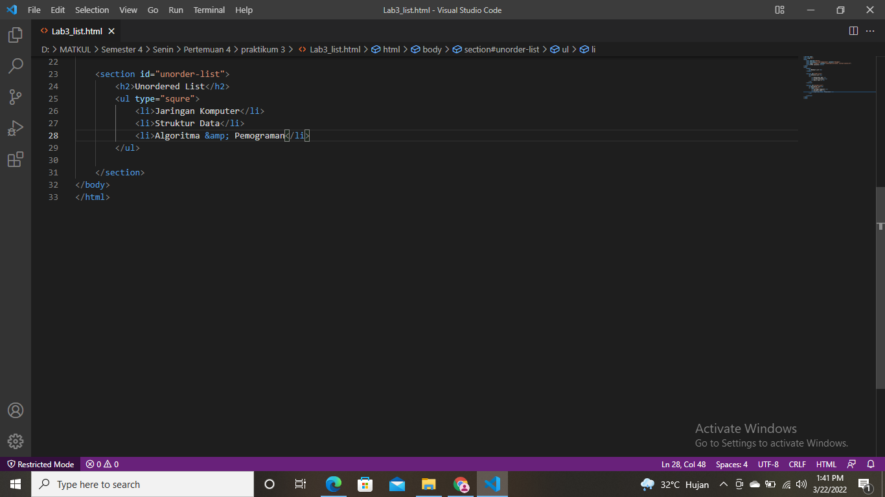
* Maka akan ada tambahan seperti gambar berikut.
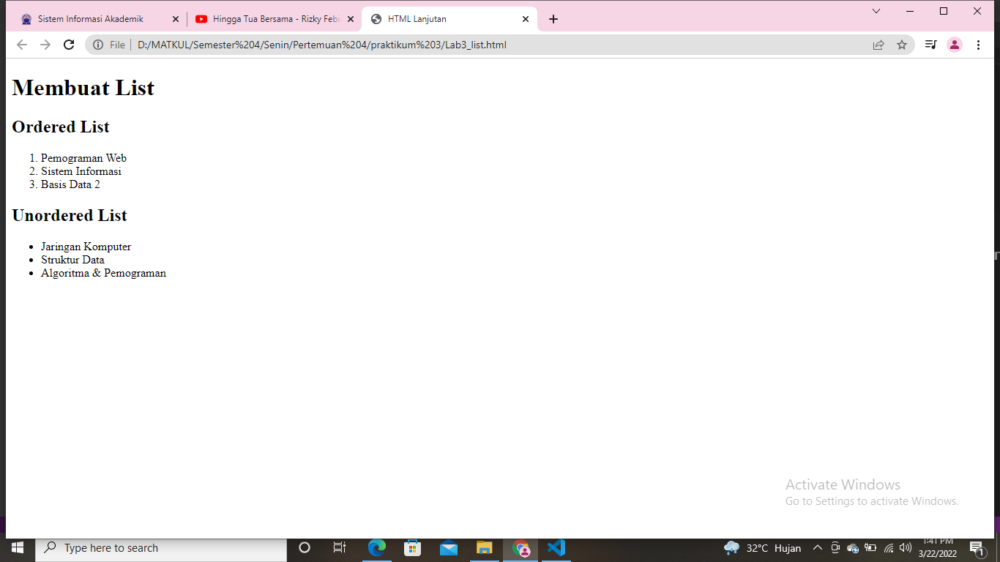

4. Membuat description list setelah unorder-list.
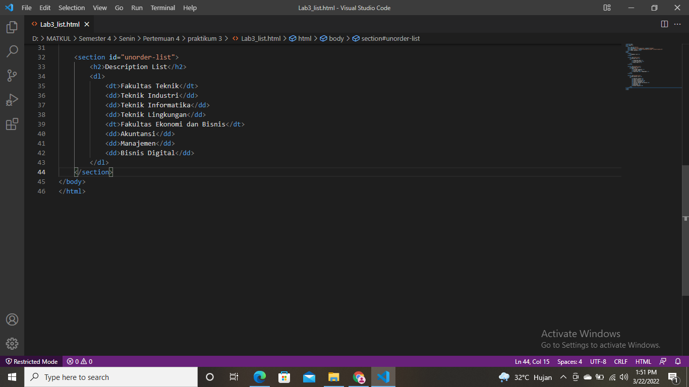
* Maka hasil gambar akan seperti ini.
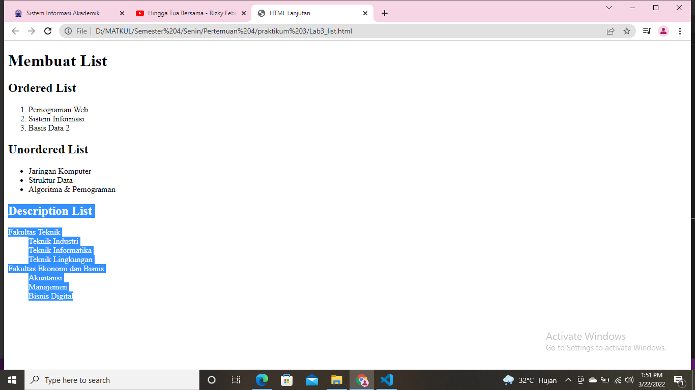

" MEMBUAT TABEL "
1. Membuat file baru dengan nama Lab3_tabel.html. Kemudian menambahkan kode untuk membuat tabel sederhana, serta mengatur margin dan padding pada cell data.
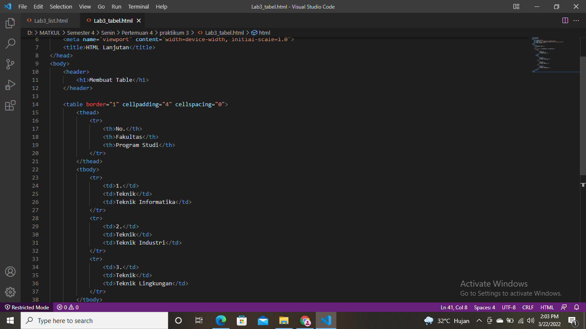
* Maka akan muncul gambar seperti berikut.
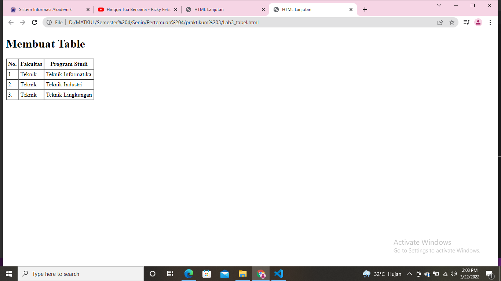

 2. Menggabungkan cell data menggunakan atribut rowspan(vertical) dan colspan(horizontal).
 
 * Maka akan ada perbedaan pada gambar sebelumnya dan sesudahnya seperti berikut.
 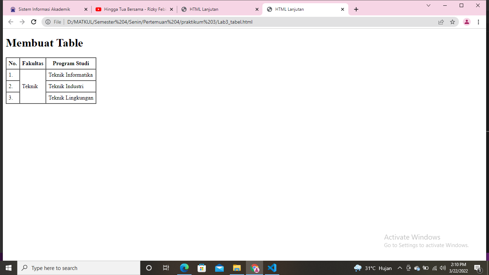

 

" MEMBUAT FORM "
1. membuat file baru dengan nama lab3_form.html.
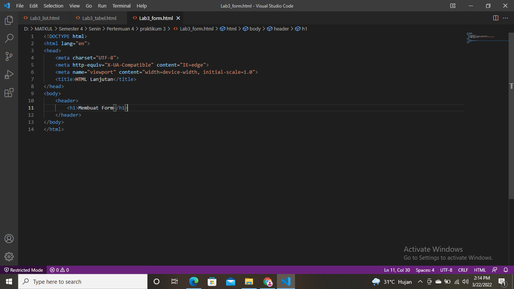

2. Selanjutnya tambahkan kode untuk membuat tabel sederhana seperti gambar berikut.
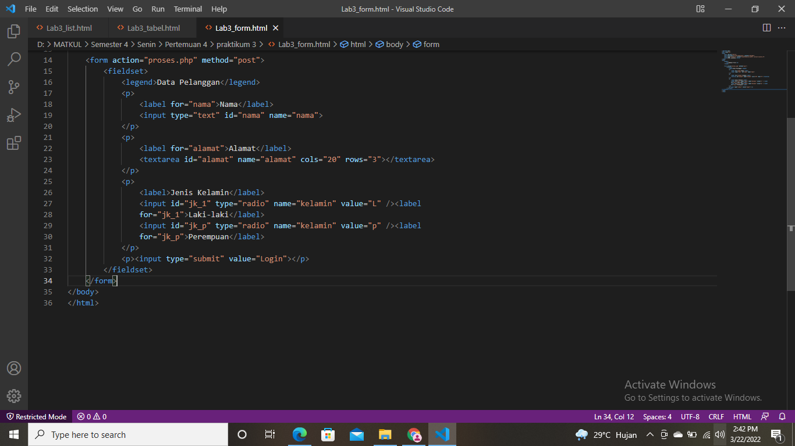
* Maka hasil nya akan sebagai berikut.
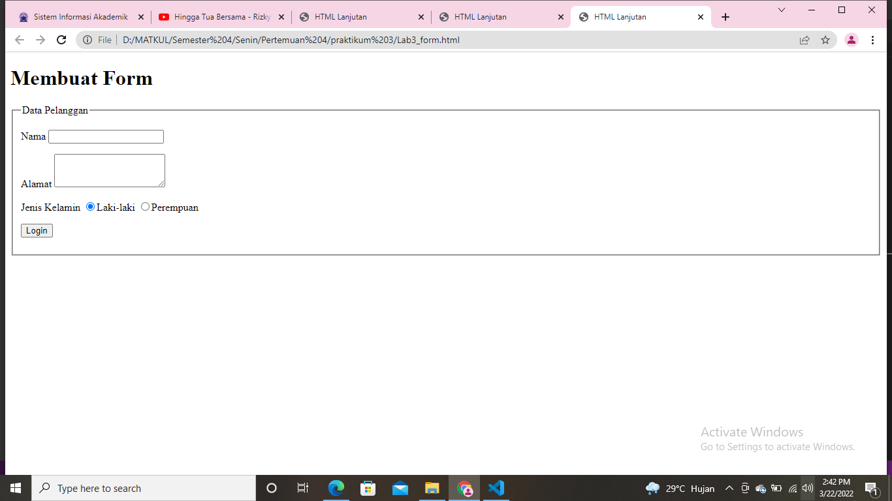

3. Menambahkan style pada form agar lebih menarik.
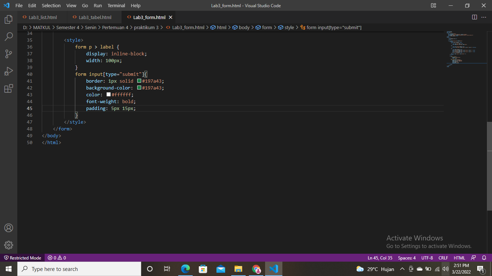
* Maka akan ada perubahan pada gambar berikut.
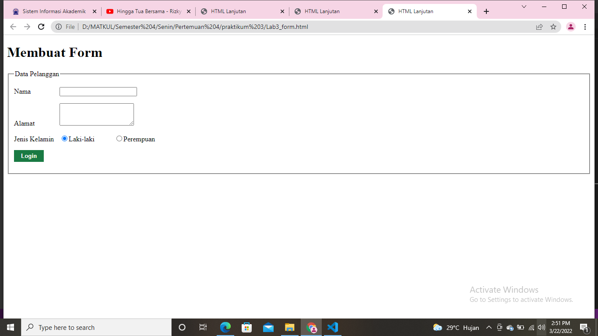

